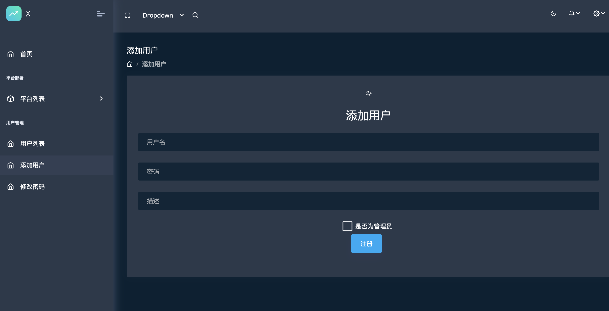
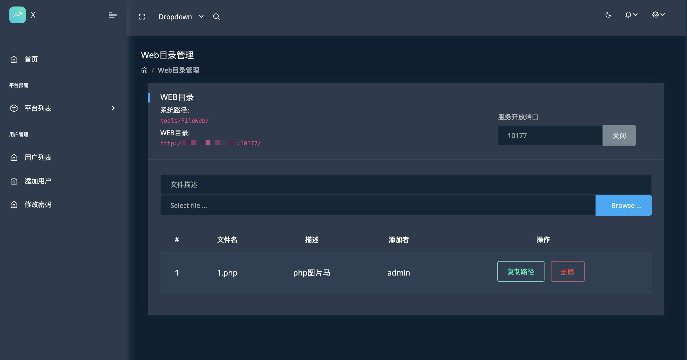
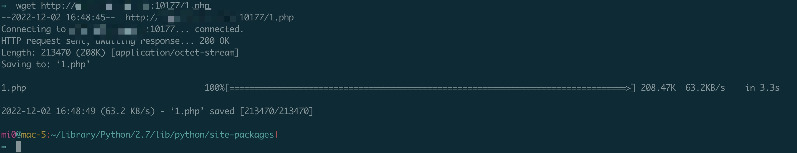
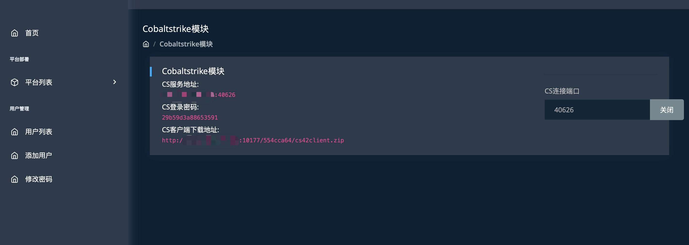
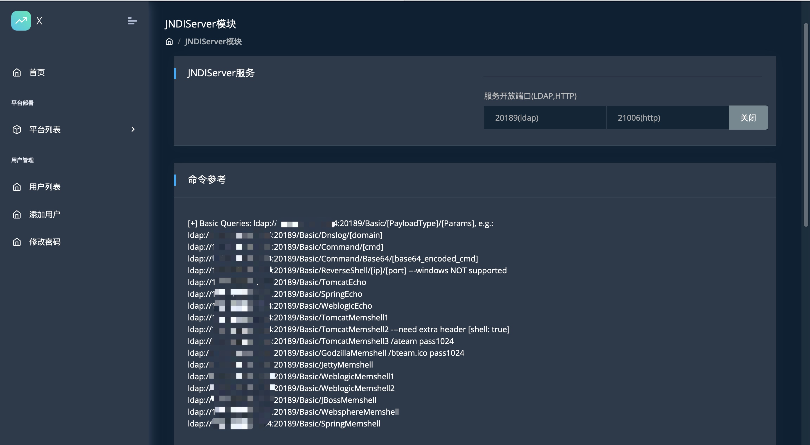
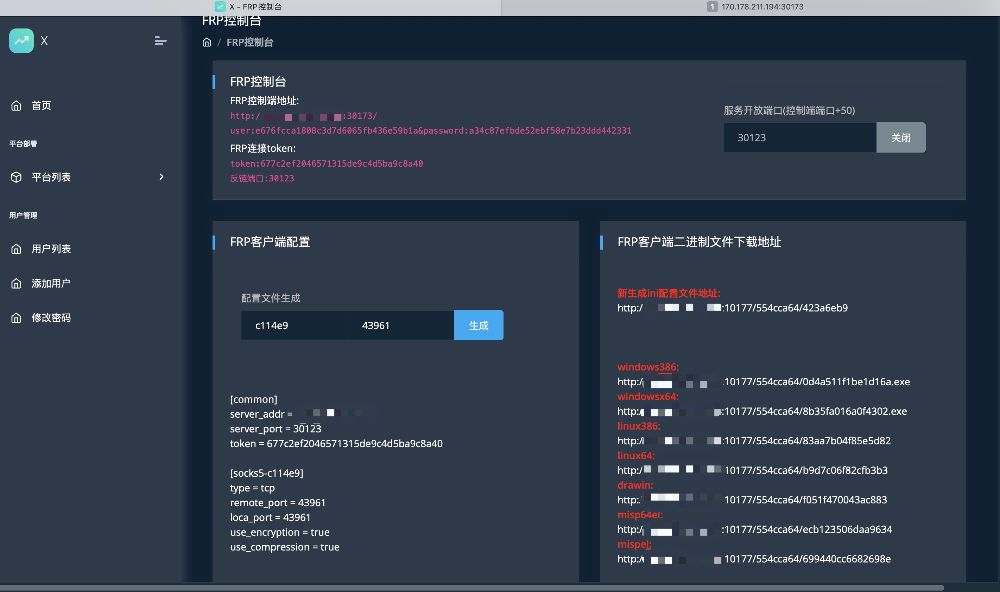
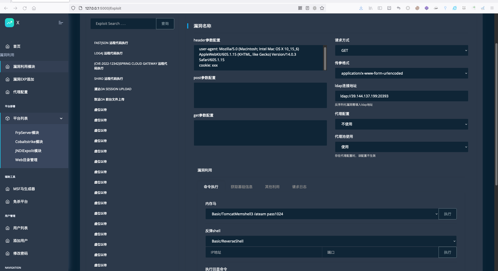

# X

## 简介
X 是一款红蓝对抗快速搭建基础设施的一个平台，主要解决红蓝对抗中队员直接经常沟通frp配置，cs之类的服务地址，浪费了大量时间的痛点。

- [x] 文件目录功能  

- [x] frp模块

- [x] cs服务开启(打了xss补丁，https://github.com/burpheart/CVE-2022-39197-patch)

- [x] ldap服务

## 开发记录
2022.9.21 整体架构设计，搭建系统框架

2022.12.2 阉割版上线

## 使用说明

### 部署说明
该系统目前只支持linux部署且是vps服务器，要有公网ip，特殊情况除外。

需要python3环境

```
git clone https://github.com/SiJiDo/X.git
cd X
pip3 install -r requirements.txt
nohup python3 run.py &
```

启动端口为50111，可以在run.py里面修改
```

if __name__ == "__main__":
    app.run(debug=False, port=50111, host="0.0.0.0")
```

### 平台登录

初始化管理员账号密码 admin/admin


### 添加用户
没啥好讲的，管理员能够添加删除用户，普通用户只能操作平台。


### fileweb平台
一个用python起的web服务，方便渗透时用wget下载文件用，或者共享与队友共享马用

web地址会自动获取当前服务的公网地址，直接复制就可以了，端口可指定，不填随机。




### cs平台
开启cs，但是不是太建议大型红蓝对抗中用，因为实战中对cs服务器隐藏要求还挺高的，cdn隐藏配置没法统一化，所以该服务在小型地市HW中还是可以用用

cs服务使用了profile进行流量行为修改，可过一些特征检测(https://github.com/wikiZ/service_cobaltstrike)

注意这里客户端需要开启fileweb服务，才能进行下载。



### jndi工具

现在反序列漏洞场景非常多，JNDIExpolit(https://github.com/WhiteHSBG/JNDIExploit)这个工具方便了很多漏洞利用时的操作，因此将其集成与此，下面命令参考中的ip和端口和根据当前部署环境和开启端口自动变化，直接复制就可以了




### frp模块
frp模块开启后，可视化界面web的端口是server的端口号+50，开启web服务主要是来检查是否成功反链回来。每次开关用户密码，token都是会有变化的，客户端和客户端配置文件ini都是依托于webfile模块进行下载，配置也可以通过旁边复制过去。

注意: 重启会导致之前的连接失效




## 其他说明
本来X这个平台我是想写EXP利用平台的，集合免杀，一键代理隧道，支持EXP高度扩展功能，目前的功能其实是这个想法的一小部分，但是一直没有时间和没有构思明白，有空的时候再完善吧。

腰斩的内容orz

